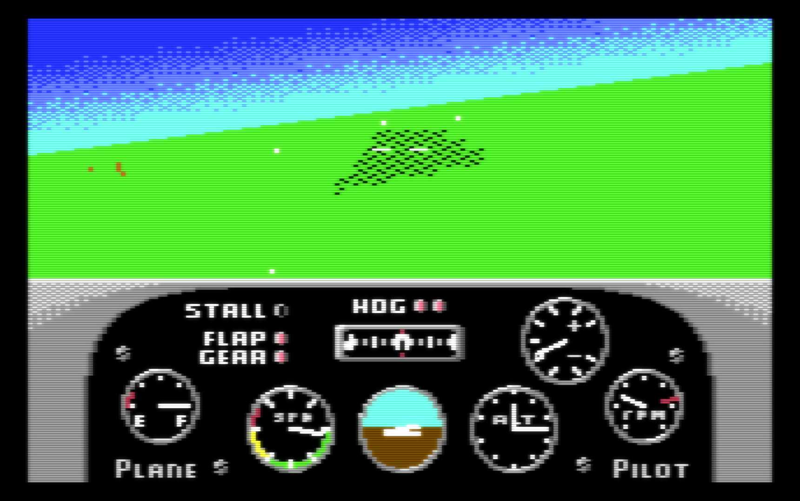
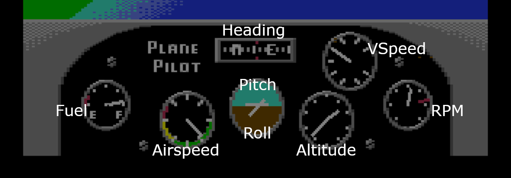

# Plane Pilot

Plane Pilot is a 3D flight simulator demo for the C64.



## History and motivation

Plane Pilot is an attempt to show how modern compilers and AI tools can
be used in to create something retro in 2026. It is also an attempt
to push the boundaries of C64 in a somewhat non-typical genre -
3D simulations - something the C64 was absolutely not designed to do.

## How to play

There are many online and offline C64 emulators.
One of the easiest: https://ty64.krissz.hu/

Click the web icon and paste the URL:

```
https://github.com/Dornbi/plane-pilot/raw/refs/heads/main/bin/ppilot.prg
```

Alternatively, download the [ppilot.prg](bin/ppilot.prg) binary and upload it to any of the online or offline emulators:

- https://c64online.com/ (online)
- https://retrogamecoders.com/c64-emulator/ (online)
- [VICE](https://vice-emu.sourceforge.io/) (offline)

## Updates

### 2026-07-05

- Added support for polygons: runway, lakes
- There is a 32x16 basic map now (map view coming)
- Added support for side views (left and right)
- Many optimizations and bug fixes

### 2026-04-30

- First release.

## Features

What you can do in Plane Pilot:

- Fly around in the world
- Render the horizon with gradients
- Basic 3D feel by rendering moving dots on the ground
- Some objects (runway, lakes, etc.) as polygons
- Dashboard and basic instrument panel
- Basic flight model: speed, altitude, movement, roll, pitch, yaw, stall.
- Keyboard controls
- Maintain around 10 frames per second

What you cannot do:

- There are no goals or opponents
- No interaction with the objects - no takeoff, no landing
- No joystick support
- No sound

Instrument panel:



## Controls

To fly the plane you can use the following keys:

| Keys            | Action                                 |
| --------------- | -------------------------------------- |
| `I` `J` `K` `L` | Roll and pitch                         |
| `A` `S`         | Yaw                                    |
| `+` `-`         | Throttle up and down                   |
| `F`             | Toggle flaps                           |
| `G`             | Toggle landing gear                    |
| `1` `2` `3`     | Look left, forward, right              |
| `N`             | Toggle Nav point 1 / 2 (runways)       |
| `D`             | Toggle debug info                      |
| `M`             | Toggle map view                        |
| `R`             | Reset to starting state                |
| `T`             | Reset to alternate starting state      |
| `P`             | Pause flight (controls still work)     |
| `X` `Z`         | Move forward and backward(when paused) |
| `H`             | Show the help screen                   |
| `Q`             | Quit to the main menu                  |

The help screen (`H`) is also available from the main menu.

## Development

Much of the code was written with Antigravity and Gemini. Prototyping and
data generation was done in Python, and the C64 code is in C with some assembly.
To compile the code, you need the [oscar64](https://github.com/drmortalwombat/oscar64/blob/main/README.md) cross-compiler.

See [development.md](development.md) for more details.

## Inspirations

- **Stunt Car Racer** is one of the best 3D games for C64, released in 1989 ([YouTube](https://www.youtube.com/watch?v=KMgjmIW8fd8))
- **Spitfire 40** is an earlier flight sim from 1985 ([YouTube](https://www.youtube.com/watch?v=cpq0VzBINno))
- **Chuck Yeager's Air Combat** is a much more advanced flight sim for DOS/PC from 1991, served as an inspiration for the horizon rendering ([YouTube](https://www.youtube.com/watch?v=L1x7229289w))
