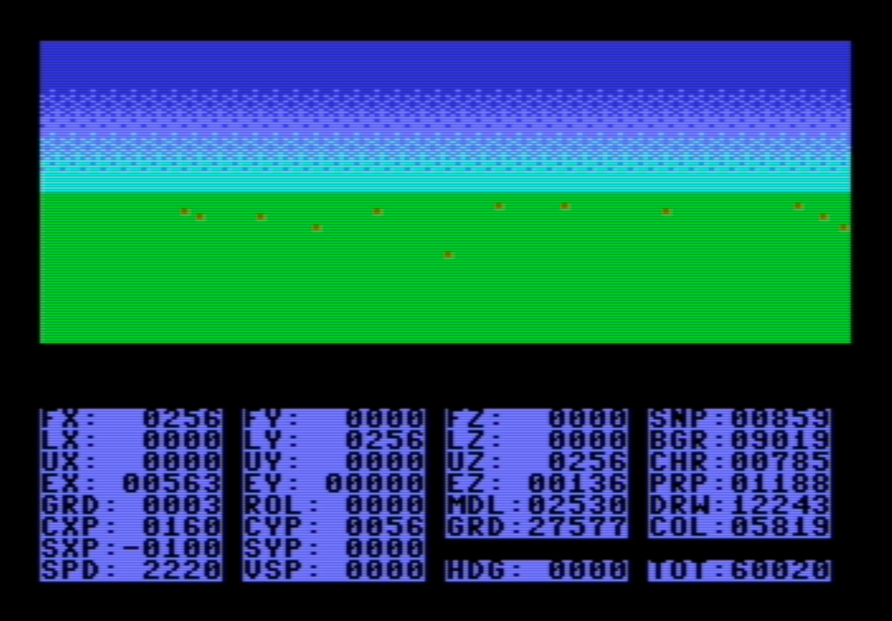
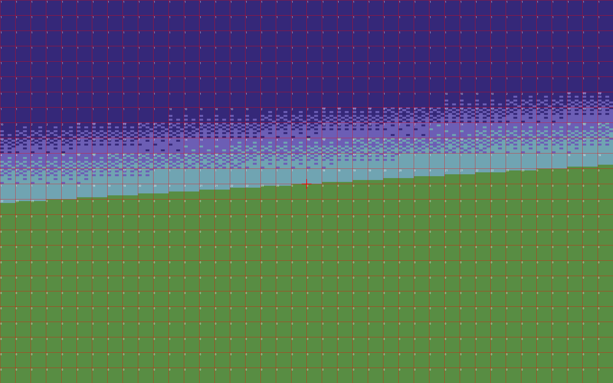

# Plane Pilot

## Background

Plane Pilot came to be from an idea to vibe-code a game demo on C64 using an agent.
At the end it is probably 50-60% was vibe coded using [Antigravity](https://antigravity.google/) and Gemini.

About the “game”: the goal was to create something a different than most C64 games.
There are many great platformers, scrolling, and shooting games on the platform.
Plane Pilot is something the C64 is not great for: a “3D” flight sim, with reasonable frame rate.

## Compiling the C64 code

The C64 code is mostly written in C. The files have a .cc extenstion because they
use some C++ features. oscar64 can optimize code pretty well, so only the most critical parts
are written in assembly.

Compiling the C64 code needs the install the [oscar64](https://github.com/drmortalwombat/oscar64/blob/main/README.md) cross-compiler and `make`. You may need to adjust `OSCAR64_INCLUDE` in the [c64o/Makefile](../c64o/Makefile).

```bash
make prg
```

If everything goes well it builds these executables into `c64o/`:

- `ppilot.prg`: The main executable.
- `polydemo.prg`: Polygon rendering prototype.
- `vecdemo.prg`: Simple character mode prototype of the dots on the ground.
- `vectest.prg`: Correctness test and cycle count for 3D vector operations.

## Releasing a build

`c64o/*.prg` is build output and gitignored. The copies in [bin/](../bin) are the
checked-in ones that README links to for the online emulators, so a build only
reaches anyone after it is published there:

```bash
make release
```

This builds and then copies the four `.prg` files into `bin/`, reporting which
ones actually changed. Check the result with `git status bin/` and commit it
along with the source change that produced it — otherwise the downloadable
binary drifts behind the code.

## Debug info

With the `D` key the instrument panel shows debug info instead of the instrument panel.

The left hand side show the state of the plane:

| Label          | Value        |
| -------------- | ------------ |
| `FX` `FY` `FZ` | Front vector |
| `LX` `LY` `LZ` | Left vector  |
| `UX` `UY` `UZ` | Up vector    |
| `EX` `EY` `EZ` | Eye position |

The right hand side shows the cycles spent in various stages of rendering.

| Label | Value                                        |
| ----- | -------------------------------------------- |
| `SNP` | "Snap" the view vector to screen coordinates |
| `BGR` | Draw the background without the sky gradient |
| `CHR` | Copy the relevant characters to char RAM     |
| `PRP` | Prepare tiles for rendering                  |
| `DRW` | Draw the tiles                               |
| `COL` | Copy to the color RAM                        |
| `MDL` | Model the plane state (motion etc.)          |
| `GRD` | Draw the grid dots on the ground             |



## Python prototype and scripts

The Python library is in [lib/](../lib), and the command line tools that drive it
are in [tools/](../tools). The most important ones:

- [generate_frame.py](../tools/generate_frame.py): Generates a single reference frame as PNG.

- [generate_all.py](../tools/generate_all.py): Generates reference frames that match the C64 graphics
  capabilities at all roll angles as PNG, and turns them into:
  - [chardefs.py](../lib/chardefs.py): The character set used to render the sky gradient.
  - [boxdefs.py](../lib/boxdefs.py): The tiles used to render the sky gradient.

- [render_frame.py](../tools/render_frame.py): Renders a single frame using the generated chardefs and boxdefs.

- [render_all.py](../tools/render_all.py): Renders frame using the generated chardefs and boxdefs.

- [flight_demo.py](../tools/flight_demo.py): A more interactive demo to test roll and pitch usiing
  the chardefs and boxdefs.

- [generate_sprites.py](../tools/generate_sprites.py): Generates sprite data for the C64 code.

The tools take their canonical flags from the [Makefile](../Makefile) in the repo
root, so prefer the make targets over calling the scripts by hand:

```bash
make data       # regenerate chardefs, boxdefs, gfx chars and sprites
make render     # render all roll angles to out/
make prg        # build the C64 binaries via c64o/Makefile
make help       # list everything
```

Generated images and frames are written to `out/`, which is gitignored. The
scripts anchor their own paths to the repo root, so they work from any directory.

There are some unit tests in the [tests](../tests) directory. You can run them with:

```bash
make test
```

This is an example reference frame from [generate_frame.py](../tools/generate_frame.py) for roll `r16u1`:



## Design conisderations

Rendering the horizon gradient at a reasonable frame rate has been an important consideration
from the start. To speed things up, it uses multicolor charater mode (MCCM), with pre-rendered
characters and tiles for the 60 fixed roll angles. Each tile is somewhere between 4x5 and 6x16
characters, and each tile uses up to 32 unique characters. All in all:

- There are 60 roll angles.
- There are 68 `boxdef`s: 60 for one of each roll angle,
  and 8 alternate ones with some of the angles. For example for the horizontal horizon,
  the main `boxdef` aligns with the character boundary, while the alternate goes through
  the middle of the character.
- The sum of tile size for the 68 `boxdef`s 3268 characters.
- They use 333 unique characters across all `boxdef`s. Since this is more than 256,
  the characters for the current `boxdef` are constantly being copied into the character RAM
  (up to 32 chars at a time).

Another consideration was the colors to use. In MCCM, 3 colors are fixed for the whole screen,
and the fourth color can be customized using the color RAM. To achieve a reasonable gradient,
4 colors are used: green, cyan, light blue and blue. Sticking with these 4 colors in the entire
viewport would make things easier, but also would make the entire color
space a bit flat. Instead, it uses a fifth color (orange) for the dots
on the ground. Since the color ram is a fixed address ad $D800, this
means it has to be copied to the VIC II chip every frame. With the current
scheme other objects using the first 8 colors of the paletter would
be relatively easy to add, for example black or white.

Double buffering is achieved by switching the screen RAM, and copying
the color RAM at every frame. In addition, alternate frames use a different
region of the character RAM, with 32 characters each.

The instrument panel is rendered in multicolor bitmap model (MCBM).
The switch between the two modes is done at a raster interrupt.

The executable is 27 kilobytes. At runtime there is about 22 kilobyte ram still free,
so the only bottleneck to turn this into a real game is the token limit at human time.
